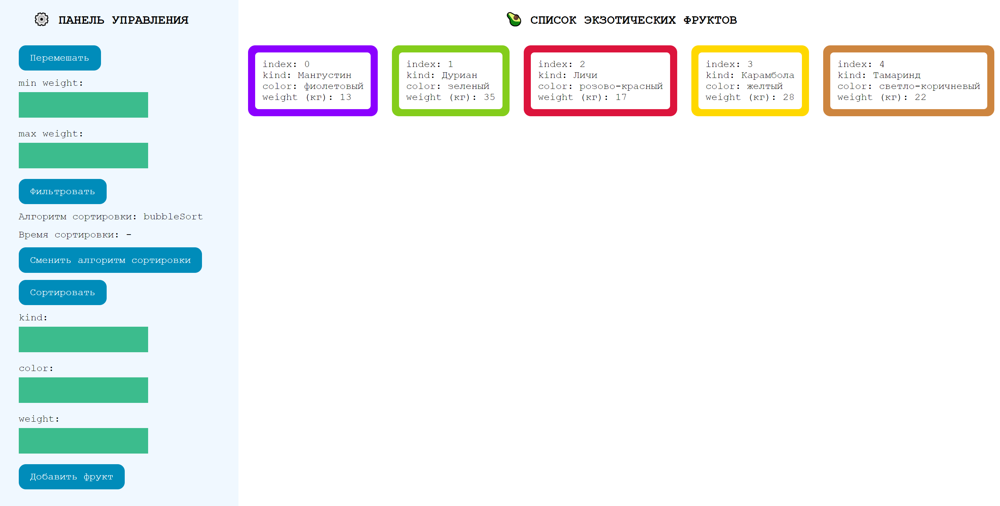

# Практическая работа модуль 10

Практическое задания в рамках курса Fullstack веб-разработчик на JavaScript и PHP:

## Задание 10.11.1 (HW-03) — Программа для фермера

---

## Интерфейс

### Интерактивные элементы

- Кнопка "Перемешать" для перемешивания катрочек;
- Блок фильтрации катрочек по весу фруктов (поля для ввода информации о минимальном и максимальном весе фруктов и кнопка фильтровать);
- Блок сортировки катрочек по цвету  (в порядке известном только создателю....);
- Блок добавления новой карточки.

## Используемые технологии

- HTML

- CSS

- JS

## Как открыть/запустить

Зайти в папку сайта в файловом менеджере, кликнуть 2 раза по файлу index.html или по [cсылке](index.html).
